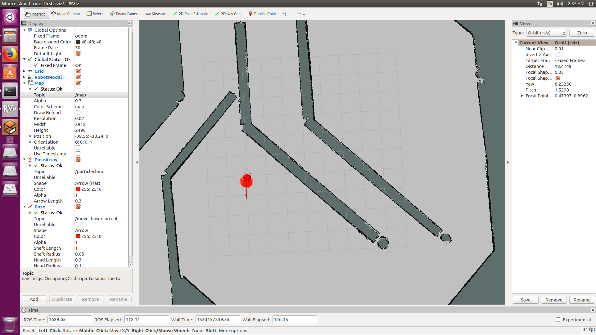
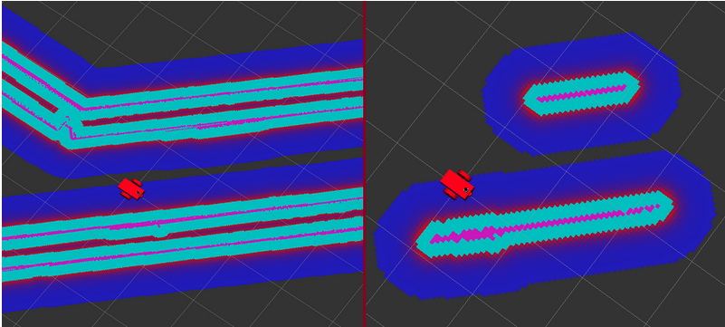

# Robot localization in a mapped environment using Adaptive Monte Carlo algorithm
## Udacity Term 2 RoboND Localization Project
##Author - Sagarnil Das

### Abstract
Localization is the challenge of determining the robot’s pose in a mapped environment. This is done by implementing a probabilistic algorithm to filter noisy sensor measurements and track the robot’s position and orientation. This paper focuses on localizing a robot in a known mapped environment using Adaptive Monte Carlo Localization[1] or Particle Filters method and send it to a goal state. ROS, Gazebo and RViz were used as the tools of the trade to simulate the environment and programming two robots for performing localization. 

### Introduction
THE localization problem is of utmost importance in the real world as this gives us a probabilistic estimate of the robot’s current position and orientation. So, it is very obvious that without this knowledge, the robot won’t be able to take effective decisions and take sound actions if it doesn’t know where it is located in the world. There are 3 different types of localization problems.

• a) Local Localization: This is the easiest localization problem. It is also known as position tracking. In this problem, the robot knows its initial pose and the localization challenge entails estimating the robot’s pose as it moves out in the environment. This problem is not trivial as there is always some uncertainty in robot motion. However, the uncertainty is limited to regions surrounding the robot.

• b) Global Localization: This is a more complicated localization problem. In this case, the robot’s initial pose is unknown and the robot must determine its pose relative to the ground truth map. The amount of uncertainty is much higher.

• c) The kidnapped robot problem: This is the most challenging localization problem. This is just like the global localization problem, except that the robot may be kidnapped at any time and moved to a new location on the map.

Fig. 1: Robot Localization

Two robots were developed and tested in a simulation environment. Both the robots successfully localized themselves and navigated the maze using Adaptive Monte Carlo algorithm (AMCL). The benchmark robot’s URDF was given as a part of the project whereas the second robot was build independently. The benchmark robot was called UdacityBot and the 2nd robot was called SagarBot. The world-map is
called ’Jackal-Race’ and was created by Clearpath Robotics.[2] The simulation was done in a ROS [3] environment using Gazebo and RViz.

### RESULTS
SagarBot navigated the same path as UdacityBot. The difference in mass had an effect on the time to reach the goal. SagarBot, being significantly heavier took longer to reach the goal.

#### Localization Results

##### Benchmark - UdacityBot
The time taken for the particle filters to converge was around 5-6 seconds. The UdacityBot reaches the goal within approximately two minutes. So the localization results are pretty decent considering the time taken for the localization and reaching the goal. However, it does not follow a smooth path for reaching the goal. Initially, the robot heads towards the north as it was unable to add the obstacle over there in its local cost-map and hence it followed the shortest path to the goal. But soon, it discovered the presence of the obstacle and it changed its strategy to the next shortest route to reach
the goal, i.e. head south-east, turn around where the obstacle ends and reach the goal.

##### Student - DougBot
The time taken for the particle filters to converge was around 30-40 seconds. The SagarBot reaches the goal within approximately 15-20 minutes. So here, a deterioration of the results is observed. This can be attributed to the heavier mass of the SagarBot, even though no wheel slippage was kept for both the robots in their respective URDFs.

#### Technical Comparison
Sagarbot is considerably heavier than the benchmark UdacityBot. Also, SagarBot has a square and bigger base than the UdacityBot.

### DISCUSSION
UdacityBot performed significantly better than SagarBot. This might be attributed to the fact that SagarBot is considerably heavier than UdacityBot. This significantly changed SagarBot’s speed and hence the time it takes to reach the goal also increased. Sagarbot, which occupies more space than UdacityBot also had a problem navigating with a higher inflation radius as it thought the obstacles to be
thicker than they really are and hence deducing that it has not enough space to navigate. As a result, sometimes SagarBot froze in one place trying to figure out an alternate route which took a long time. So, when the inflation radius was decreased, the performance of SagarBot improved considerably. The obstacle range was also another important parameter to tune. SagarBot, being slower in speed naturally wastes a lot of time if it goes to the wrong direction only to find an obstacle there. So in order to be able to successfully add an obstacle to its cost-map[4] from a significantly larger distance, this parameter was increased which resulted in significant improvement of SagarBot’s performance.[5]

Figure 4. shows how global and local cost-maps are calculated.

On the left, we have the global costmap displaying all the occupied areas based on the provided map. And on the right, we have the local costmap of the same region. The local costmap is only displaying what the laser sensor captures during that time period.

### Topics

• UdacityBot performed better.

• One might infer the better performance of UdacityBot due to its smaller mass.

• In the ’Kidnapped-robot’ problem, one has to successfully account for the scenario that at any point in time, the robot might be kidnapped and placed in a totally different position of the world.
In any scenario, where the world map is known, but the position of the robot is not, localization can be successfully used. MCL/AMCL can work well in any industry domain where the robot’s path is guided by clear obstacles and where the robot is supposed to reach the goal state from anywhere in the map. The ground also needs to be flat and obstacle free, particularly in the cases where the laser range-finder is at a higher position and cannot detect objects on the ground.

### CONCLUSION / FUTURE WORK
Both robots satisfied the two conditions, i.e. Both were successfully localized with the help of AMCL algorithm. and both reached the goal state within a decent time limit. UdacityBot performed better than SagarBot which can be attributed to the heavier mass of SagarBot. This time difference was reduced significantly by increasing the obstacle range and inflation radius parameters. The main issue with both the robots was erroneous navigation as both of the robots took a sub-optimal route due to the lack of knowledge of an obstacle beforehand. However, as the primary focus of this project was localization, this problem was ignored due to time constraint. Even though both the robots reached the goal eventually, as they failed to take the optimal route to the goal location, this implies that neither of these robots can be deployed in commercial products. Placement of the laser scanner can also play a vital role in the robot’s navigation skill. Placing the scanner too high from the ground could result in the robot missing obstacles in the ground and then get stuck on it causing a total sensor malfunction. On the other hand, placing the scanner too low may prevent the robot from perceiving better as it gets more viewing range in this situation. So this would be another important modification to improve the robots. Future work would involve making both the robots commercially viable by working on making/tuning a better navigation planner. Also, the present model deployed only has one robot in a world at a time. In future, this project could be expanded to include multiple robots in the same world, each with the same goal or a different one.

### Hardware Deployment

1) This present model was done in a simulation environment in a local computer hosting Ubuntu 16.04 on a core-i7 machine and NVIDIA GTX 1080Ti GPU. In order to deploy it in a hardware system like NVIDIA Jetson TX2, the TX2 prototype board camera could be connected into the model with suitable drivers. Laser range-finder hardwares would also need to be integrated in order the hardware version to successfully operate and detect obstacles. It would also need GIO connections for driving the wheels and be implemented on a suitable platform modeling the robot which was simulated.

2) The JETSON TX2 has sufficient has adequate processing power both in CPU and GPU memory to successfully host this model.

## References
[1] S. Thrun, Particle filters in Robotics. Carnegie Mellon University, 2002.
[2] C. Robotics, “Navigating with jackal,”
[3] M. Quigley et al, “Ros: an open-source robot operating system,” 2009.
[4] https://autonomoustuff.com/product-category/lidar/hokuyo-laser scanners/, “Hokuyo scanner home page,” 2018.
[5] http://wiki.ros.org/navigation/Tutorials/Navigationbasicnavigation tuning guide,” 2018.

